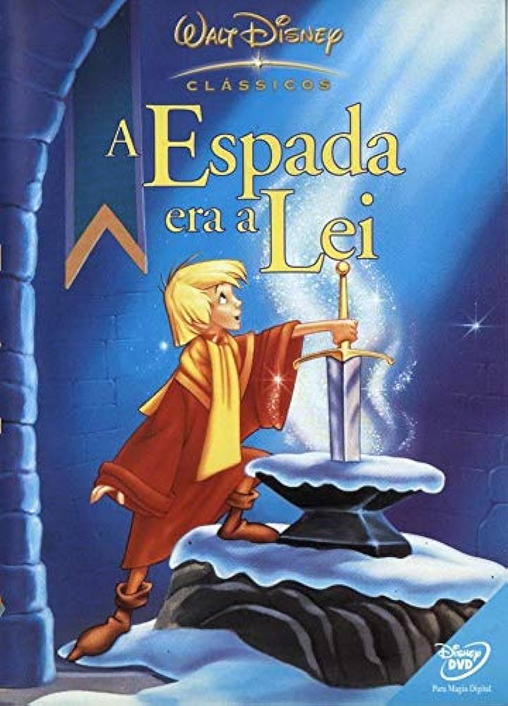
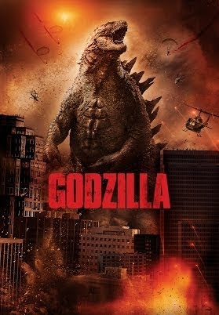
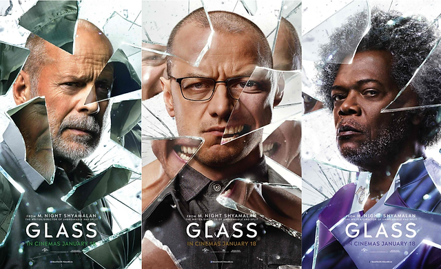
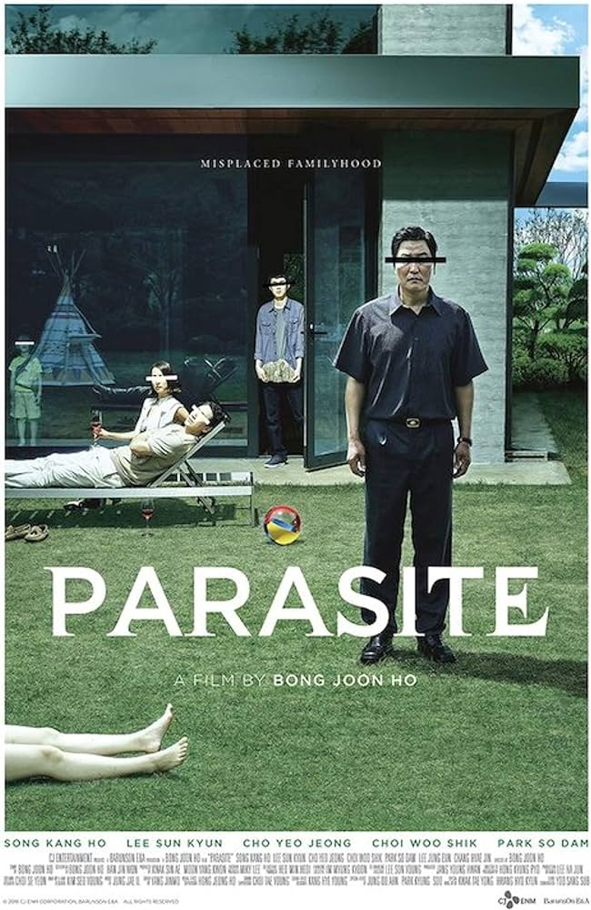
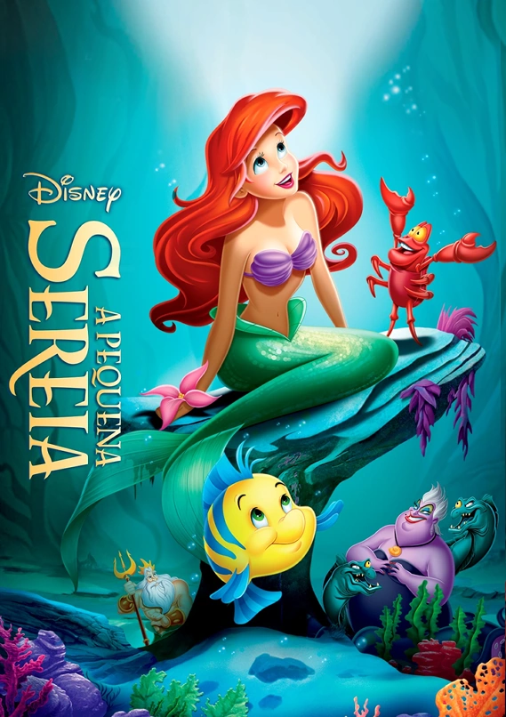

<h1>Tarefa byron semana 1</>

#### Autores:

- ##### [Ana Clara Souza Alves](https://github.com/anacsalves)
- ##### [Talles Alves](https://github.com/Tsplay25)

<h2>Introdução</>

### Essa tarefa visa mostrar o que aprendemos na primeira semana de capacitação da byron, principalmente sobre Git e Github. Para isso, escolhemos criar um "TOP 10" com os melhores filmes de todos os tempos, de acordo com nossa opinião.

<h2>Top 5 - Talles:</>

#### O quesito nostalgia foi levado (muito) em consideração :sweat_smile::

#### 1. Eragon

O Reino de Alagaësia é governado pelo maligno rei Galbatorix, um antigo Cavaleiro de Dragão que traiu seu povo e seus companheiros em busca de poder. Quando Eragon, um garoto órfão que vive em uma pequena fazenda, encontra uma pedra azul, seu destino muda, pois o objeto na verdade era um ovo de dragão do último sobrevivente da raça. A dragão fêmea Saphira nasce do ovo e Eragon se torna um Cavaleiro, que luta contra o Espectro Durza e o exército de Galbatorix, cumprindo uma antiga profecia.

#### 2. A espada era a lei

Adaptação da Disney da fábula sobre as origens humildes do Rei Arthur. Como uma criança órfã, Arthur era conhecido como Wart, que queria ajudar seu irmão adotivo Kay a ser um cavaleiro. Enquanto ajudava Kay em seu treinamento, Wart se deparou com uma cabana pertencente a Merlin, um mago desastrado, mas talentoso. Merlin faz o possível para convencer o menino que ele está destinado à grandeza e quando viaja com Kay para Londres para atender uma competição, eles descobrem que Merlin tinha razão.

#### 3. Transformers (não sei definir qual :laughing:)

O destino da humanidade está em jogo quando duas raças de robôs, os Autobots e os vilões Decepticons, chegam à Terra. Os robôs possuem a capacidade de se transformarem em diferentes objetos mecânicos enquanto buscam a chave do poder supremo com a ajuda do jovem Sam.

#### 4. Godzilla (2014)

Um especialista em bombas da marinha norte-americana acaba de se reunir com a família em São Francisco, Estados Unidos, quando é forçado a ir para o Japão para ajudar seu pai. Logo, os dois se deparam com um grande acontecimento: Godzilla, o rei dos monstros, surge do mar para combater criaturas inimigas. Em uma luta pela supremacia, os monstros ameaçam a sobrevivência da humanidade. Por onde passam, deixam um rastro de destruição, rumo ao local da batalha final: São Francisco.

#### 5. Os incríveis

Depois do governo banir o uso de superpoderes, o maior herói do planeta, o Sr. Incrível, vive de forma pacata com sua família. Apesar de estar feliz com a vida doméstica, o Sr. Incrível ainda sente falta dos tempos em que viveu como super-herói, e sua grande chance de entrar em ação novamente surge quando um velho inimigo volta a atacar. Só que agora ele precisa contar com a ajuda de toda a família para vencer o vilão.

<h2>Top 5 - Ana:</>

#### Uma boa mistura entre cult, geek e nostalgicos 🎭

### 1.Interestelar

Um dos melhores dos últimos tempos no quesito viagem no tempo. O longa-metragem conta a complexa história de Cooper, um piloto da NASA que tem a difícil tarefa de salvar a espécie humana da extinção. Num cenário de catástrofe, o planeta Terra começa a sofrer com crises ambientais sérias. A solução encontrada pela NASA é descobrir outro planeta onde os humanos possam habitar. A missão de Cooper, ao lado de outros astronautas, é descobrir qual planeta será a nossa futura casa e salvar a humanidade.Com uma trama complexa, o filme Interestelar levanta uma série de dilemas morais e éticos difíceis.

### 2.Trilogia Corpo Fechado

A trilogia segue a jornada de David Dunn, um homem que descobre ter habilidades sobre-humanas após sobreviver a um acidente de trem. Ao longo dos filmes "Corpo Fechado", "Fragmentado" e "Vidro", ele enfrenta vilões como Elijah Price, também conhecido como Mr. Glass, e Kevin Wendell Crumb, que possui múltiplas personalidades. A narrativa se desdobra em uma trama intricada, revelando a interconexão entre os personagens e culminando em um confronto final na tentativa de revelar a existência de super-humanos ao mundo. A trilogia é marcada por reviravoltas surpreendentes e uma exploração única do conceito de super-heróis e vilões no contexto do mundo real.

### 3.Barbie -A Princesa e a Plebeia

A melhor animação entre as duas listas.
Em Barbie: A Princesa e a Plebeia, Anneliese, a princesa de um reino distante, é sequestrada pelo conselheiro do rei, Preminger. Erika, uma jovem plebeia que vive em um vilarejo próximo, é a única que pode salvá-la.As duas meninas são idênticas fisicamente, e Erika consegue se passar por Anneliese para enganar Preminger. Ela assume o lugar da princesa no reino e começa a lutar para salvar o dia. No final, Erika consegue derrotar Preminger e salvar Anneliese.

### 4.Parasita

Parasita é um filme sul-coreano de 2019 dirigido por Bong Joon-ho. O filme conta a história de uma família pobre que se infiltra na vida de uma família rica.A família Kim consegue enganar a família Park e se estabelecer na mansão deles. No entanto, a situação começa a se complicar quando os segredos e mentiras necessários para a ascensão social começam a vir à tona. O filme é uma crítica à desigualdade social na Coreia do Sul. Também explora temas como o parasitismo, a manipulação e o desejo de ascensão social.

### 5.A Pequena Sereia (1989)

A Pequena Sereia, um clássico da Disney, conta a história de Ariel, uma princesa sereia que se apaixona por um príncipe humano. Para ficar com ele, ela faz um acordo com a bruxa do mar Úrsula e troca sua voz por pernas. Ariel precisa conquistar o amor do príncipe antes do prazo, ou perderá sua voz e se tornará uma serva de Úrsula para sempre.

## 🎥 E quais são seus filmes preferidos?

Envie um pull request e nos diga seu TOP 5 também! :smile:
